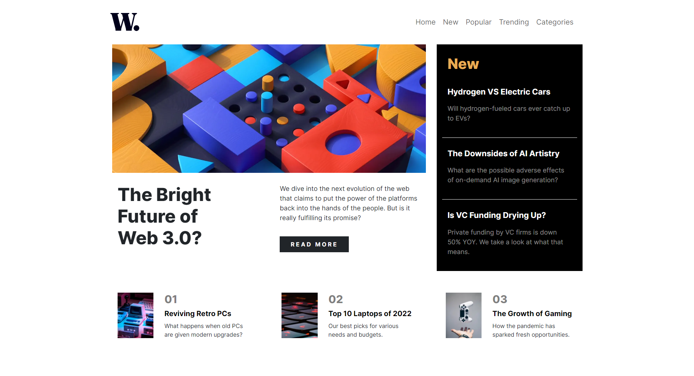

# News Homepage

A responsive news homepage developed by Ahmed Hanye for Frontend Mentor.

Live Demo : [Demo 🎯](https://ahmedhanye.github.io/news-homepage-main/)

## Project Description:

This project is a responsive news homepage built using HTML, CSS, and Bootstrap. It features a clean and modern design aimed at providing users with a pleasant browsing experience. The homepage includes sections for featured articles, recent news, and popular topics. It also incorporates off-canvas navigation for easy access to different sections of the website.

## Project Structure:

- index.html: The main HTML file containing the structure of the homepage.
- CSS/:
  normalize_min.css: CSS file for normalizing styles across different browsers.
  bootstrap.min.css: Bootstrap CSS file for styling components and layout.
  main.css: Custom CSS file for additional styling and layout adjustments.
- assets/:
  images/: Directory containing image assets used in the project.
- JS/:
  bootstrap.bundle.min.js: JavaScript file for Bootstrap components and interactions.

## Credits:

- Ahmed Hanye: Frontend development
- Frontend Mentor: Project inspiration and design specifications

## Feedback and Contributions:
Feedback and contributions are welcome! If you find any issues or have suggestions for improvements, feel free to open an issue or submit a pull request.

